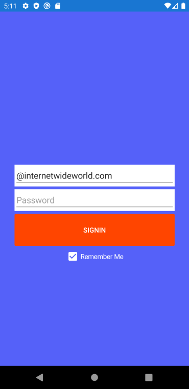
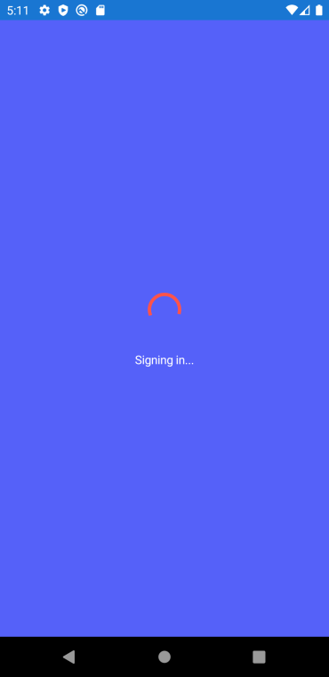
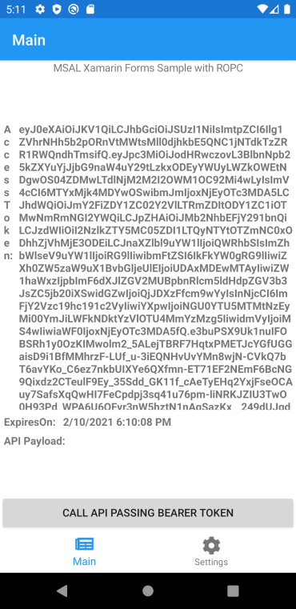
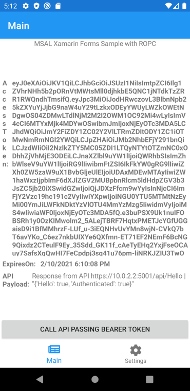
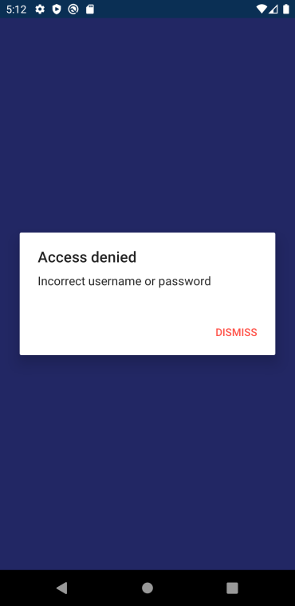
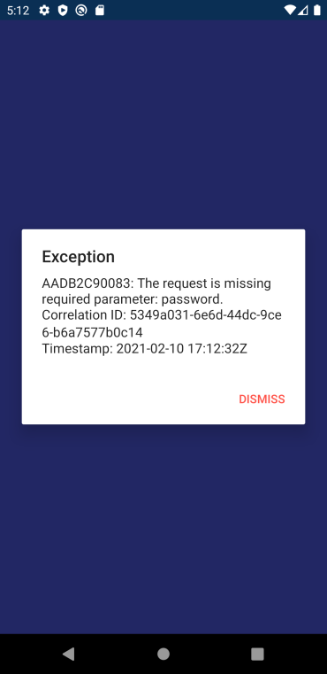

# ADB2CROPCXamarinForms
## Overview
This is a simple Xamarin Forms app showcasing how to use MSAL with a ROPC (Resource Owner Password Credentials) flow, to authenticate users via Azure Active Directory B2C, and access an DOTNET CORE Web API with the resulting token.
- For more information on Azure B2C, see the [Azure AD B2C](https://docs.microsoft.com/en-us/azure/active-directory-b2c/overview) documentation.
- For more information on ROPC flow, see the [Set up a resource owner password credentials flow in Azure Active Directory B2C](https://docs.microsoft.com/en-us/azure/active-directory-b2c/add-ropc-policy).

### Prerequisites
- You must have an existing Azure Active Directory B2C tenant. See [Create an Azure Active Directory B2C tenant](Docs/CreateAzureADB2CTenant.md) for details.
- You must have created sign-in and ROPC policies within an Azure Active Directory B2C tenant. See [Create Policies](Docs/CreateAzureADB2CPolicies.md) for details.
- You must have created Azure Active Directory B2C application registrations for the Web API service and mobile client.  See [Create App Registration](Docs/CreateAzureADB2CAppRegistrations.md) for details.
- A user account in your Azure Active Directory B2C tenant. See [Import Azure AD B2C Users](Docs/ImportAzureADB2CUsers.md) for details.
- [Visual Studio 2019](https://aka.ms/vsdownload). Install or update Visual Studio with the following workloads:
	- Universal Windows Platform Development
	- Mobile Development with .Net
  
	Then from the "Individual Components" tab, make sure these additional items are selected:
	- Android SDK setup (API level 29)
	- Windows 10 SDK (10.0.17134.0)
	- Android SDK level 29, and Android SDK build tools 27.0.3 are also required. These are not installed through the VS Installer, so instead use the Android SDK Manager (Visual Studio > Tools > Android > Android SDK Manager�)
- An Internet connection
- A Windows, OS X, or Linux machine (necessary if you want to run the app on their respective platforms)
- Setup [Xamarin.iOS for Visual Studio](https://docs.microsoft.com/en-us/xamarin/ios/get-started/installation/windows/introduction-to-xamarin-ios-for-visual-studio) (if you want to run the iOS app) - This will require Visual Studio on PC, and on a Mac Machine where XCode is installed.

## Screenshots







## How To Run This Sample
### Step 1: Clone or download this repository

From your shell or command line:

```powershell
git clone https://github.com/GeorgeLeithead/ADB2CROPCXamarinForms.git
```

### Step 2: Configure the Visual Studio Back-End project with your app coordinates.
This sample includes a sample API.
1. Open the solution in Visual Studio.
1. Open the `BackEnd\ADB2CROPCXamarinForms.HelloService\appsettings.json` file.
1. Find the assignment for `AzureAdB2C:TenantId` and replace XXX with your tenant id.
1. Find the assignment for `AzureAdB2C:Instance` and replace XXX with your Azure AD B2C tenant name.
1. Find the assignment for `AzureAdB2C:ClientId` and replace XXX with the Web API service Application ID.
1. Find the assignment for `AzureAdB2C:Domain` and replace XXX with the Azure AD B2C tenant name.
1. Find the assignment for `AzureAdB2C:SignedOutCallbackPath` and replace XXX the name of the sign-in policy.
1. Find the assignment for `AzureAdB2C:SignUpSignInPolicyId` and replace XXX the name of the sign-in policy.

### Step 3: Configure the Visual Studio mobile application with your app coordinates.
1. Open the solution in Visual Studio.
1. Open the `Mobile\ADB2CROPCXamarinForms' project.
1. Add a new JSON file to the project, called `AppSettings.json`.
1. With the file selected change the properties (Right-click and select 'Properties' OR press F4) "Build Action" to `Embeded Resource`.
1. Edit the `AppSettings.json` file, and add the following content:

```json
{
	// WebApi
	"ApiEndpoint": "localhost",
	"HelloServicePath": "api/Hello",
	"HelloServiceAlivePath": "/Alive",
	// Azure AD B2C coordinates
	"TenantName": "XXX",
	"TenantId": "XXX.onmicrosoft.com",
	"AzureADB2CHostname": "{0}.b2clogin.com",
	"ClientId": "XXX",
	"PolicySignIn": "B2C_1_XXX",
	"PolicyRopc": "B2C_1_XXX",
	"AuthorityBase": "https://{0}/tfp/{1}/",
	"Scopes": "https://{0}/sp/access_as_user",
	// Key Chain group name
	"IosKeychainSecurityGroups": "com.companyname.ADB2CROPCXamarinForms"
}
```
1. Find the assignment for `TenantName` and replace XXX with your Azure AD B2C tenant name.
1. Find the assignment for `TenantId` and replace XXX with your Azure AD B2C tenant name.
1. Find the assignment for `ClientId` and replace XXX with the mobile client Application ID.
1. Find the assignment for `PolicySignIn` and replace XXX the name of the sign-in policy.
1. Find the assignment for `PolicyRopc` and replace XXX the name of the ROPC policy.

### Step 4: Run a local instance if the BackEnd
> :warning: When running a local *debug* version of the mobile application(s), it is required that a local instance of the back-end service is running *before* starting the mobile app in debug mode.

The mobile project is configured to be able to run against 'local' instance of the back-end service.

1. On Windows run PowerShell and navigate to the root of the cloned directory
1. In PowerShell run:
	```PowerShell
	cd .\ADB2CROPCXamarinForms\src\BackEnd\ADB2CROPCXamarinForms.HelloService
	dotnet build
	dotnet run
	```
1. The service can be accesses via the URLs as indicated by the build info.  For example in the following this would be https://localhost:5001 and http://localhost:5000:
```Text
info: Microsoft.Hosting.Lifetime[0]
      Now listening on: https://localhost:5001
info: Microsoft.Hosting.Lifetime[0]
      Now listening on: http://localhost:5000
info: Microsoft.Hosting.Lifetime[0]
      Application started. Press Ctrl+C to shut down.
info: Microsoft.Hosting.Lifetime[0]
      Hosting environment: Development
info: Microsoft.Hosting.Lifetime[0]
      Content root path: .\ADB2CROPCXamarinForms\src\BackEnd\ADB2CROPCXamarinForms.HelloService
```

1. When finished using the local instance of the service, press `CTRL+C`

### Step 5: Run the mobile app
1. Choose the platform you want to work on by setting the startup project in the Solution Explorer.  Make sure that your platform of choice is marked for build and deploy in the Configuration Manager.
1. Clean the solution, rebuild the solution, and run it.
1. On the Sign-in page, enter the sign-in username and password of a known Azure AD B2C tenant user, and click the sign-in button.  Upon successful sign in, the application screen will display the `access token` and `expires on` for the authenticated user and show a button that allows you to call an API.
1. Close the application and reopen it.  You will see that the app retains access to the API and retrieves the access token and expires on information right away, without the need to sign in again.
1. Sign out by click the `Settings` tab and then the `Sign out` button.

##### Running in an Android Emulator

If you have issues with the Android emulator, please refer to [this document](https://github.com/Azure-Samples/active-directory-general-docs/blob/master/AndroidEmulator.md) for instructions on how to ensure that your emulator supports the features required by MSAL.

## More information
- For more information on Azure B2C, see [the Azure AD B2C documentation homepage](http://aka.ms/aadb2c).
- [Configure session behavior in Azure Active Directory B2C](https://docs.microsoft.com/en-us/azure/active-directory-b2c/session-behavior)
- For a faster Android emulator, consider [using with Hyper-V](https://docs.microsoft.com/en-us/xamarin/android/get-started/installation/android-emulator/hardware-acceleration?pivots=windows). This might require turning on Virtualization in BIOS settings of your PC.
- [Managing Virtual Devices with the Android Device Manager](https://docs.microsoft.com/en-us/xamarin/android/get-started/installation/android-emulator/device-manager).
- For more information on acquiring tokens with MSAL.NET, please visit [MSAL.NET's conceptual documentation](https://github.com/AzureAD/microsoft-authentication-library-for-dotnet/wiki), in particular:
	- [PublicClientApplication](https://github.com/AzureAD/microsoft-authentication-library-for-dotnet/wiki/Client-Applications#publicclientapplication)
	- [Recommended call pattern in public client applications](https://github.com/AzureAD/microsoft-authentication-library-for-dotnet/wiki/AcquireTokenSilentAsync-using-a-cached-token#recommended-call-pattern-in-public-client-applications)
	- [Acquiring tokens interactively in public client application flows](https://github.com/AzureAD/microsoft-authentication-library-for-dotnet/wiki/Acquiring-tokens-interactively)
- To understand more about the Microsoft identity platform endpoint see http://aka.ms/aaddevv2
- For more information about how the protocols work in this scenario and other scenarios, see [Authentication Scenarios for Microsoft identity platform](http://go.microsoft.com/fwlink/?LinkId=394414).
- For more information about Microsoft Graph, please visit [the Microsoft Graph homepage](https://graph.microsoft.io/en-us/)